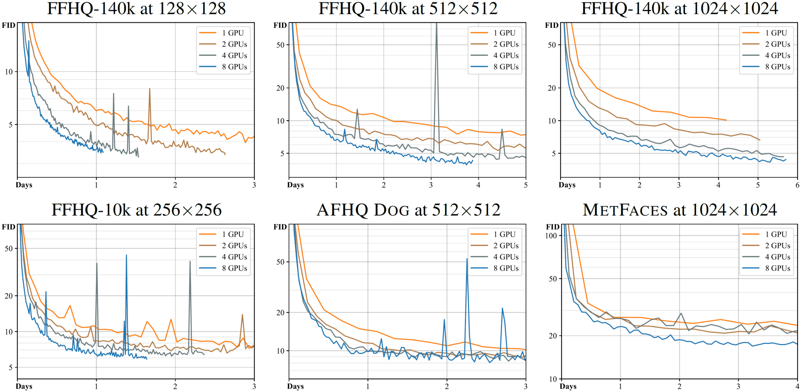

## StyleGAN2 with adaptive discriminator augmentation (ADA)<br>&mdash; Official TensorFlow implementation


**Training Generative Adversarial Networks with Limited Data**<br>
Tero Karras, Miika Aittala, Janne Hellsten, Samuli Laine, Jaakko Lehtinen, Timo Aila<br>
https://arxiv.org/abs/2006.06676<br>

Abstract: *Training generative adversarial networks (GAN) using too little data typically leads to discriminator overfitting, causing training to diverge. We propose an adaptive discriminator augmentation mechanism that significantly stabilizes training in limited data regimes. The approach does not require changes to loss functions or network architectures, and is applicable both when training from scratch and when fine-tuning an existing GAN on another dataset. We demonstrate, on several datasets, that good results are now possible using only a few thousand training images, often matching StyleGAN2 results with an order of magnitude fewer images. We expect this to open up new application domains for GANs. We also find that the widely used CIFAR-10 is, in fact, a limited data benchmark, and improve the record FID from 5.59 to 2.42.*

For business inquiries, please contact [researchinquiries@nvidia.com](mailto:researchinquiries@nvidia.com)<br>
For press and other inquiries, please contact Hector Marinez at [hmarinez@nvidia.com](mailto:hmarinez@nvidia.com)<br>

## Looking for the PyTorch version?

The [Official PyTorch version](https://github.com/NVlabs/stylegan2-ada-pytorch) is now available and supersedes the TensorFlow version. See the full list of versions [here](https://nvlabs.github.io/stylegan2/versions.html).

## What's new

This repository supersedes the original [StyleGAN2](https://github.com/NVlabs/stylegan2) with the following new features:

* **ADA**: Significantly better results for datasets with less than ~30k training images. State-of-the-art results for CIFAR-10.
* **Mixed-precision support**: ~1.6x faster training, ~1.3x faster inference, ~1.5x lower GPU memory consumption.
* **Better hyperparameter defaults**: Reasonable out-of-the-box results for different dataset resolutions and GPU counts.
* **Clean codebase**: Extensive refactoring and simplification. The code should be generally easier to work with.
* **Command line tools**: Easily reproduce training runs from the paper, generate projection videos for arbitrary images, etc.
* **Network import**: Full support for network pickles produced by [StyleGAN](https://github.com/NVlabs/stylegan) and [StyleGAN2](https://github.com/NVlabs/stylegan2). Faster loading times.
* **Augmentation pipeline**: Self-contained, reusable GPU implementation of extensive high-quality image augmentations.
* **Bugfixes**

## External data repository

| Path | Description
| :--- | :----------
| [stylegan2-ada](https://nvlabs-fi-cdn.nvidia.com/stylegan2-ada/) | Main directory hosted on Amazon S3
| &ensp;&ensp;&boxvr;&nbsp; [ada-paper.pdf](https://nvlabs-fi-cdn.nvidia.com/stylegan2-ada/ada-paper.pdf) | Paper PDF
| &ensp;&ensp;&boxvr;&nbsp; [images](https://nvlabs-fi-cdn.nvidia.com/stylegan2-ada/images/) | Curated example images produced using the pre-trained models
| &ensp;&ensp;&boxvr;&nbsp; [videos](https://nvlabs-fi-cdn.nvidia.com/stylegan2-ada/videos/) | Curated example interpolation videos
| &ensp;&ensp;&boxur;&nbsp; [pretrained](https://nvlabs-fi-cdn.nvidia.com/stylegan2-ada/pretrained/) | Pre-trained models
| &ensp;&ensp;&ensp;&ensp;&boxvr;&nbsp; metfaces.pkl | MetFaces at 1024x1024, transfer learning from FFHQ using ADA
| &ensp;&ensp;&ensp;&ensp;&boxvr;&nbsp; brecahad.pkl | BreCaHAD at 512x512, trained from scratch using ADA
| &ensp;&ensp;&ensp;&ensp;&boxvr;&nbsp; afhqcat.pkl | AFHQ Cat at 512x512, trained from scratch using ADA
| &ensp;&ensp;&ensp;&ensp;&boxvr;&nbsp; afhqdog.pkl | AFHQ Dog at 512x512, trained from scratch using ADA
| &ensp;&ensp;&ensp;&ensp;&boxvr;&nbsp; afhqwild.pkl | AFHQ Wild at 512x512, trained from scratch using ADA
| &ensp;&ensp;&ensp;&ensp;&boxvr;&nbsp; cifar10.pkl | Class-conditional CIFAR-10 at 32x32
| &ensp;&ensp;&ensp;&ensp;&boxvr;&nbsp; ffhq.pkl | FFHQ at 1024x1024, trained using original StyleGAN2
| &ensp;&ensp;&ensp;&ensp;&boxvr;&nbsp; [paper-fig7c-training-set-sweeps](https://nvlabs-fi-cdn.nvidia.com/stylegan2-ada/pretrained/paper-fig7c-training-set-sweeps/) | All models used in Fig.7c (baseline, ADA, bCR)
| &ensp;&ensp;&ensp;&ensp;&boxvr;&nbsp; [paper-fig8a-comparison-methods](https://nvlabs-fi-cdn.nvidia.com/stylegan2-ada/pretrained/paper-fig8a-comparison-methods/) | All models used in Fig.8a (comparison methods)
| &ensp;&ensp;&ensp;&ensp;&boxvr;&nbsp; [paper-fig8b-discriminator-capacity](https://nvlabs-fi-cdn.nvidia.com/stylegan2-ada/pretrained/paper-fig8b-discriminator-capacity/) | All models used in Fig.8b (discriminator capacity)
| &ensp;&ensp;&ensp;&ensp;&boxvr;&nbsp; [paper-fig11a-small-datasets](https://nvlabs-fi-cdn.nvidia.com/stylegan2-ada/pretrained/paper-fig11a-small-datasets/) | All models used in Fig.11a (small datasets, transfer learning)
| &ensp;&ensp;&ensp;&ensp;&boxvr;&nbsp; [paper-fig11b-cifar10](https://nvlabs-fi-cdn.nvidia.com/stylegan2-ada/pretrained/paper-fig11b-cifar10/) | All models used in Fig.11b (CIFAR-10)
| &ensp;&ensp;&ensp;&ensp;&boxvr;&nbsp; [transfer-learning-source-nets](https://nvlabs-fi-cdn.nvidia.com/stylegan2-ada/pretrained/transfer-learning-source-nets/) | Models used as starting point for transfer learning
| &ensp;&ensp;&ensp;&ensp;&boxur;&nbsp; [metrics](https://nvlabs-fi-cdn.nvidia.com/stylegan2-ada/pretrained/metrics/) | Feature detectors used by the quality metrics

## Requirements

* Linux and Windows are supported, but we recommend Linux for performance and compatibility reasons.
* 64-bit Python 3.6 or 3.7. We recommend Anaconda3 with numpy 1.14.3 or newer.
* We recommend TensorFlow 1.14, which we used for all experiments in the paper, but TensorFlow 1.15 is also supported on Linux. TensorFlow 2.x is not supported.
* On Windows you need to use TensorFlow 1.14, as the standard 1.15 installation does not include necessary C++ headers.
* 1&ndash;8 high-end NVIDIA GPUs with at least 12 GB of GPU memory, NVIDIA drivers, CUDA 10.0 toolkit and cuDNN 7.5.
* Docker users: use the [provided Dockerfile](./Dockerfile) to build an image with the required library dependencies.

The generator and discriminator networks rely heavily on custom TensorFlow ops that are compiled on the fly using NVCC. On Windows, the compilation requires Microsoft Visual Studio to be in `PATH`. We recommend installing [Visual Studio Community Edition](https://visualstudio.microsoft.com/vs/) and adding it into `PATH` using `"C:\Program Files (x86)\Microsoft Visual Studio\2019\Community\VC\Auxiliary\Build\vcvars64.bat"`.

## Getting started

Pre-trained networks are stored as `*.pkl` files that can be referenced using local filenames or URLs:

```.bash
# Generate curated MetFaces images without truncation (Fig.10 left)
python generate.py --outdir=out --trunc=1 --seeds=85,265,297,849 \
    --network=https://nvlabs-fi-cdn.nvidia.com/stylegan2-ada/pretrained/metfaces.pkl

# Generate uncurated MetFaces images with truncation (Fig.12 upper left)
python generate.py --outdir=out --trunc=0.7 --seeds=600-605 \
    --network=https://nvlabs-fi-cdn.nvidia.com/stylegan2-ada/pretrained/metfaces.pkl

# Generate class conditional CIFAR-10 images (Fig.17 left, Car)
python generate.py --outdir=out --trunc=1 --seeds=0-35 --class=1 \
    --network=https://nvlabs-fi-cdn.nvidia.com/stylegan2-ada/pretrained/cifar10.pkl
```

Outputs from the above commands are placed under `out/*.png`. You can change the location with `--outdir`. Temporary cache files, such as CUDA build results and downloaded network pickles, will be saved under `$HOME/.cache/dnnlib`. This can be overridden using the `DNNLIB_CACHE_DIR` environment variable.

**Docker**: You can run the above curated image example using Docker as follows:

```.bash
docker build --tag stylegan2ada:latest .
docker run --gpus all -it --rm -v `pwd`:/scratch --user $(id -u):$(id -g) stylegan2ada:latest bash -c \
    "(cd /scratch && DNNLIB_CACHE_DIR=/scratch/.cache python3 generate.py --trunc=1 --seeds=85,265,297,849 \
    --outdir=out --network=https://nvlabs-fi-cdn.nvidia.com/stylegan2-ada/pretrained/metfaces.pkl)"
```

**Note**: The above defaults to a container base image that requires NVIDIA driver release `r455.23` or later.  To build an image for older drivers and GPUs, run:

```.bash
docker build --build-arg BASE_IMAGE=tensorflow/tensorflow:1.14.0-gpu-py3 --tag stylegan2ada:latest .
```

## Projecting images to latent space

To find the matching latent vector for a given image file, run:

```.bash
python projector.py --outdir=out --target=targetimg.png \
    --network=https://nvlabs-fi-cdn.nvidia.com/stylegan2-ada/pretrained/ffhq.pkl
```

For optimal results, the target image should be cropped and aligned similar to the original FFHQ dataset. The above command saves the projection target `out/target.png`, result `out/proj.png`, latent vector `out/dlatents.npz`, and progression video `out/proj.mp4`. You can render the resulting latent vector by specifying `--dlatents` for `python generate.py`:

```.bash
python generate.py --outdir=out --dlatents=out/dlatents.npz \
    --network=https://nvlabs-fi-cdn.nvidia.com/stylegan2-ada/pretrained/ffhq.pkl
```

## Preparing datasets

Datasets are stored as multi-resolution TFRecords, i.e., the same format used by [StyleGAN](https://github.com/NVlabs/stylegan) and [StyleGAN2](https://github.com/NVlabs/stylegan2). Each dataset consists of multiple `*.tfrecords` files stored under a common directory, e.g., `~/datasets/ffhq/ffhq-r*.tfrecords`

**MetFaces**: Download the [MetFaces dataset](https://github.com/NVlabs/metfaces-dataset) and convert to TFRecords:

```.bash
python dataset_tool.py create_from_images ~/datasets/metfaces ~/downloads/metfaces/images
python dataset_tool.py display ~/datasets/metfaces
```

**BreCaHAD**: Download the [BreCaHAD dataset](https://figshare.com/articles/BreCaHAD_A_Dataset_for_Breast_Cancer_Histopathological_Annotation_and_Diagnosis/7379186). Generate 512x512 resolution crops and convert to TFRecords:

```.bash
python dataset_tool.py extract_brecahad_crops --cropsize=512 \
    --output_dir=/tmp/brecahad-crops --brecahad_dir=~/downloads/brecahad/images

python dataset_tool.py create_from_images ~/datasets/brecahad /tmp/brecahad-crops
python dataset_tool.py display ~/datasets/brecahad
```

**AFHQ**: Download the [AFHQ dataset](https://github.com/clovaai/stargan-v2/blob/master/README.md#animal-faces-hq-dataset-afhq) and convert to TFRecords:

```.bash
python dataset_tool.py create_from_images ~/datasets/afhqcat ~/downloads/afhq/train/cat
python dataset_tool.py create_from_images ~/datasets/afhqdog ~/downloads/afhq/train/dog
python dataset_tool.py create_from_images ~/datasets/afhqwild ~/downloads/afhq/train/wild
python dataset_tool.py display ~/datasets/afhqcat
```

**CIFAR-10**: Download the [CIFAR-10 python version](https://www.cs.toronto.edu/~kriz/cifar.html). Convert to two separate TFRecords for unconditional and class-conditional training:

```.bash
python dataset_tool.py create_cifar10 --ignore_labels=1 \
    ~/datasets/cifar10u ~/downloads/cifar-10-batches-py

python dataset_tool.py create_cifar10 --ignore_labels=0 \
    ~/datasets/cifar10c ~/downloads/cifar-10-batches-py

python dataset_tool.py display ~/datasets/cifar10c
```

**FFHQ**: Download the [Flickr-Faces-HQ](https://github.com/NVlabs/ffhq-dataset) dataset as TFRecords:

```.bash
pushd ~
git clone https://github.com/NVlabs/ffhq-dataset.git
cd ffhq-dataset
python download_ffhq.py --tfrecords
popd
python dataset_tool.py display ~/ffhq-dataset/tfrecords/ffhq
```

**LSUN**: Download the desired LSUN categories in LMDB format from the [LSUN project page](https://www.yf.io/p/lsun) and convert to TFRecords:

```.bash
python dataset_tool.py create_lsun --resolution=256 --max_images=200000 \
    ~/datasets/lsuncat200k ~/downloads/lsun/cat_lmdb

python dataset_tool.py display ~/datasets/lsuncat200k
```

**Custom**: Custom datasets can be created by placing all images under a single directory. The images must be square-shaped and they must all have the same power-of-two dimensions. To convert the images to multi-resolution TFRecords, run:

```.bash
python dataset_tool.py create_from_images ~/datasets/custom ~/custom-images
python dataset_tool.py display ~/datasets/custom
```

## Training new networks

In its most basic form, training new networks boils down to:

```.bash
python train.py --outdir=~/training-runs --gpus=1 --data=~/datasets/custom --dry-run
python train.py --outdir=~/training-runs --gpus=1 --data=~/datasets/custom
```

The first command is optional; it will validate the arguments, print out the resulting training configuration, and exit. The second command will kick off the actual training.

In this example, the results will be saved to a newly created directory `~/training-runs/<RUNNING_ID>-custom-auto1` (controlled by `--outdir`). The training will export network pickles (`network-snapshot-<KIMG>.pkl`) and example images (`fakes<KIMG>.png`) at regular intervals (controlled by `--snap`). For each pickle, it will also evaluate FID by default (controlled by `--metrics`) and log the resulting scores in `metric-fid50k_full.txt`.

The name of the output directory (e.g., `00000-custom-auto1`) reflects the hyperparameter configuration that was used. In this case, `custom` indicates the training set (`--data`) and `auto1` indicates the *base configuration* that was used to select the hyperparameters (`--cfg`):

| Base config      | Description
| :----------      | :----------
| `auto` (default) | Automatically select reasonable defaults based on resolution and GPU count. Serves as a good starting point for new datasets, but does not necessarily lead to optimal results.
| `stylegan2`      | Reproduce results for StyleGAN2 config F at 1024x1024 using 1, 2, 4, or 8 GPUs.
| `paper256`       | Reproduce results for FFHQ and LSUN Cat at 256x256 using 1, 2, 4, or 8 GPUs.
| `paper512`       | Reproduce results for BreCaHAD and AFHQ at 512x512 using 1, 2, 4, or 8 GPUs.
| `paper1024`      | Reproduce results for MetFaces at 1024x1024 using 1, 2, 4, or 8 GPUs.
| `cifar`          | Reproduce results for CIFAR-10 (tuned configuration) using 1 or 2 GPUs.
| `cifarbaseline`  | Reproduce results for CIFAR-10 (baseline configuration) using 1 or 2 GPUs.

The training configuration can be further customized with additional arguments. Common examples:

* `--aug=noaug` disables ADA (default: enabled).
* `--mirror=1` amplifies the dataset with x-flips. Often beneficial, even with ADA.
* `--resume=ffhq1024 --snap=10` performs transfer learning from FFHQ trained at 1024x1024.
* `--resume=~/training-runs/<RUN_NAME>/network-snapshot-<KIMG>.pkl` resumes where a previous training run left off.
* `--gamma=10` overrides R1 gamma. We strongly recommend trying out at least a few different values for each new dataset.

Augmentation fine-tuning:

* `--aug=ada --target=0.7` adjusts ADA target value (default: 0.6).
* `--aug=adarv` selects the alternative ADA heuristic (requires a separate validation set).
* `--augpipe=blit` limits the augmentation pipeline to pixel blitting only.
* `--augpipe=bgcfnc` enables all available augmentations (blit, geom, color, filter, noise, cutout).
* `--cmethod=bcr` enables bCR with small integer translations.

Please refer to [`python train.py --help`](./docs/train-help.txt) for the full list.

## Expected training time

The total training time depends heavily on the resolution, number of GPUs, desired quality, dataset, and hyperparameters. In general, the training time can be expected to scale linearly with respect to the resolution and inversely proportional with respect to the number of GPUs. Small datasets tend to reach their lowest achievable FID faster than larger ones, but the convergence is somewhat less predictable. Transfer learning tends to converge significantly faster than training from scratch.

To give a rough idea of typical training times, the following figure shows several examples of FID as a function of wallclock time. Each curve corresponds to training a given dataset from scratch using `--cfg=auto` with a given number of NVIDIA Tesla V100 GPUs:



Please note that `--cfg=auto` only serves as a reasonable first guess for the hyperparameters &mdash; it does not necessarily lead to optimal results for a given dataset. For example, `--cfg=stylegan2` yields considerably better FID  for FFHQ-140k at 1024x1024 than illustrated above. We recommend trying out at least a few different values of `--gamma` for each new dataset.

## Preparing training set sweeps

In the paper, we perform several experiments using artificially limited/amplified versions of the training data, such as `ffhq30k`, `ffhq140k`, and `lsuncat30k`. These are constructed by first unpacking the original dataset into a temporary directory with `python dataset_tool.py unpack` and then repackaging the appropriate versions into TFRecords with `python dataset_tool.py pack`. In the following examples, the temporary directories are created under `/tmp` and can be safely deleted afterwards.

```.bash
# Unpack FFHQ images at 256x256 resolution.
python dataset_tool.py unpack --resolution=256 \
    --tfrecord_dir=~/ffhq-dataset/tfrecords/ffhq --output_dir=/tmp/ffhq-unpacked

# Create subset with 30k images.
python dataset_tool.py pack --num_train=30000 --num_validation=10000 --seed=123 \
    --tfrecord_dir=~/datasets/ffhq30k --unpacked_dir=/tmp/ffhq-unpacked

# Create amplified version with 140k images.
python dataset_tool.py pack --num_train=70000 --num_validation=0 --mirror=1 --seed=123 \
    --tfrecord_dir=~/datasets/ffhq140k --unpacked_dir=/tmp/ffhq-unpacked

# Unpack LSUN Cat images at 256x256 resolution.
python dataset_tool.py unpack --resolution=256 \
    --tfrecord_dir=~/datasets/lsuncat200k --output_dir=/tmp/lsuncat200k-unpacked

# Create subset with 30k images.
python dataset_tool.py pack --num_train=30000 --num_validation=10000 --seed=123 \
    --tfrecord_dir=~/datasets/lsuncat30k --unpacked_dir=/tmp/lsuncat200k-unpacked
```

Please note that when training with artifically limited/amplified datasets, the quality metrics (e.g., `fid50k_full`) should still be evaluated against the corresponding original datasets. This can be done by specifying a separate metric dataset for `train.py` and `calc_metrics.py` using the `--metricdata` argument. For example:

```.bash
python train.py [OTHER_OPTIONS] --data=~/datasets/ffhq30k --metricdata=~/ffhq-dataset/tfrecords/ffhq
```

## Reproducing training runs from the paper

The pre-trained network pickles ([`stylegan2-ada/pretrained/paper-fig*`](https://nvlabs-fi-cdn.nvidia.com/stylegan2-ada/pretrained/)) reflect the training configuration the same way as the output directory names, making it straightforward to reproduce a given training run from the paper. For example:

```.bash
# 1. AFHQ Dog
# paper-fig11a-small-datasets/afhqdog-mirror-paper512-ada.pkl
python train.py --outdir=~/training-runs --gpus=8 --data=~/datasets/afhqdog \
    --mirror=1 --cfg=paper512 --aug=ada

# 2. Class-conditional CIFAR-10
# pretrained/paper-fig11b-cifar10/cifar10c-cifar-ada-best-fid.pkl
python train.py --outdir=~/training-runs --gpus=2 --data=~/datasets/cifar10c \
    --cfg=cifar --aug=ada

# 3. MetFaces with transfer learning from FFHQ
# paper-fig11a-small-datasets/metfaces-mirror-paper1024-ada-resumeffhq1024.pkl
python train.py --outdir=~/training-runs --gpus=8 --data=~/datasets/metfaces \
    --mirror=1 --cfg=paper1024 --aug=ada --resume=ffhq1024 --snap=10

# 4. 10k subset of FFHQ with ADA and bCR
# paper-fig7c-training-set-sweeps/ffhq10k-paper256-ada-bcr.pkl
python train.py --outdir=~/training-runs --gpus=8 --data=~/datasets/ffhq10k \
    --cfg=paper256 --aug=ada --cmethod=bcr --metricdata=~/ffhq-dataset/tfrecords/ffhq

# 5. StyleGAN2 config F
# transfer-learning-source-nets/ffhq-res1024-mirror-stylegan2-noaug.pkl
python train.py --outdir=~/training-runs --gpus=8 --data=~/ffhq-dataset/tfrecords/ffhq \
    --res=1024 --mirror=1 --cfg=stylegan2 --aug=noaug --metrics=fid50k
```

**Notes**:
* You can use fewer GPUs than shown in the above examples. This will only increase the training time &mdash; it will not affect the quality of the results.
* Example 3 specifies `--snap=10` to export network pickles more frequently than usual. This is recommended, because transfer learning tends to yield very fast convergence.
* Example 4 specifies `--metricdata` to evaluate quality metrics against the original FFHQ dataset, not the artificially limited 10k subset used for training.
* Example 5 specifies `--metrics=fid50k` to evaluate FID the same way as in the StyleGAN2 paper (see below).

## Quality metrics

By default, `train.py` will automatically compute FID for each network pickle. We strongly recommend inspecting `metric-fid50k_full.txt` at regular intervals to monitor the training progress. When desired, the automatic computation can be disabled with `--metrics none` to speed up the training.

Additional quality metrics can also be computed after the training:

```.bash
# Previous training run: look up options automatically, save result to text file.
python calc_metrics.py --metrics=pr50k3_full \
    --network=~/training-runs/00000-ffhq10k-res64-auto1/network-snapshot-000000.pkl

# Pretrained network pickle: specify dataset explicitly, print result to stdout.
python calc_metrics.py --metrics=fid50k_full --metricdata=~/datasets/ffhq --mirror=1 \
    --network=https://nvlabs-fi-cdn.nvidia.com/stylegan2-ada/pretrained/ffhq.pkl
```

The first example will automatically find `training_options.json` stored alongside the network pickle and perform the same operation as if `--metrics pr50k3_full` had been specified during training. The second example will download a pre-trained network pickle, in which case the values of `--mirror` and `--metricdata` have to be specified explicitly.

Note that many of the metrics have a significant one-off cost (up to an hour or more) when they are calculated for the first time using a given dataset. Also note that the evaluation is done using a different random seed each time, so the results will vary if the same metric is computed multiple times.

We employ the following metrics in the ADA paper. The expected execution times correspond to using one Tesla V100 GPU at 1024x1024 and 256x256 resolution:

| Metric        | 1024x1024 | 256x256 | Description |
| :-----        | :-------: | :-----: | :---------- |
| `fid50k_full` | 15 min    | 5 min   | Fr&eacute;chet inception distance<sup>[1]</sup> against the full dataset.
| `kid50k_full` | 15 min    | 5 min   | Kernel inception distance<sup>[2]</sup> against the full dataset.
| `pr50k3_full` | 20 min    | 10 min  | Precision and recall<sup>[3]</sup> againt the full dataset.
| `is50k`       | 25 min    | 5 min   | Inception score<sup>[4]</sup> for CIFAR-10.

In addition, all metrics that were used in the [StyleGAN](https://github.com/NVlabs/stylegan) and [StyleGAN2](https://github.com/NVlabs/stylegan2) papers are also supported for backwards compatibility:

| Legacy: StyleGAN2 | 1024x1024 | Description |
| :---------------- | :-------: | :---------- |
| `fid50k`          | 15 min    | Fr&eacute;chet inception distance against 50k real images.
| `kid50k`          | 15 min    | Kernel inception distance against 50k real images.
| `pr50k3`          | 20 min    | Precision and recall against 50k real images.
| `ppl2_wend`       | 40 min    | Perceptual path length<sup>[5]</sup> in W at path endpoints against full image.

| Legacy: StyleGAN | 1024x1024 | Description |
| :--------------- | :-------: | :---------- |
| `ppl_zfull`      | 40 min    | Perceptual path length in Z for full paths against cropped image.
| `ppl_wfull`      | 40 min    | Perceptual path length in W for full paths against cropped image.
| `ppl_zend`       | 40 min    | Perceptual path length in Z at path endpoints against cropped image.
| `ppl_wend`       | 40 min    | Perceptual path length in W at path endpoints against cropped image.
| `ls`             | 10 hrs    | Linear separability<sup>[5]</sup> with respect to CelebA attributes.

References:
1. [GANs Trained by a Two Time-Scale Update Rule Converge to a Local Nash Equilibrium](https://arxiv.org/abs/1706.08500), Heusel et al. 2017
2. [Demystifying MMD GANs](https://arxiv.org/abs/1801.01401), Bi&nacute;kowski et al. 2018
3. [Improved Precision and Recall Metric for Assessing Generative Models](https://arxiv.org/abs/1904.06991), Kynk&auml;&auml;nniemi et al. 2019
4. [Improved Techniques for Training GANs](https://arxiv.org/abs/1606.03498), Salimans et al. 2016
5. [A Style-Based Generator Architecture for Generative Adversarial Networks](https://arxiv.org/abs/1812.04948), Karras et al. 2018

## License

Copyright &copy; 2020, NVIDIA Corporation. All rights reserved.

This work is made available under the [Nvidia Source Code License](https://nvlabs.github.io/stylegan2-ada/license.html).

## Citation

```
@inproceedings{Karras2020ada,
  title     = {Training Generative Adversarial Networks with Limited Data},
  author    = {Tero Karras and Miika Aittala and Janne Hellsten and Samuli Laine and Jaakko Lehtinen and Timo Aila},
  booktitle = {Proc. NeurIPS},
  year      = {2020}
}
```

## Development

This is a research reference implementation and is treated as a
one-time code drop.  As such, we do not accept outside code
contributions in the form of pull requests.

## Acknowledgements

We thank David Luebke for helpful comments; Tero Kuosmanen and Sabu Nadarajan for their support with compute infrastructure; and Edgar Sch&ouml;nfeld for guidance on setting up unconditional BigGAN.
